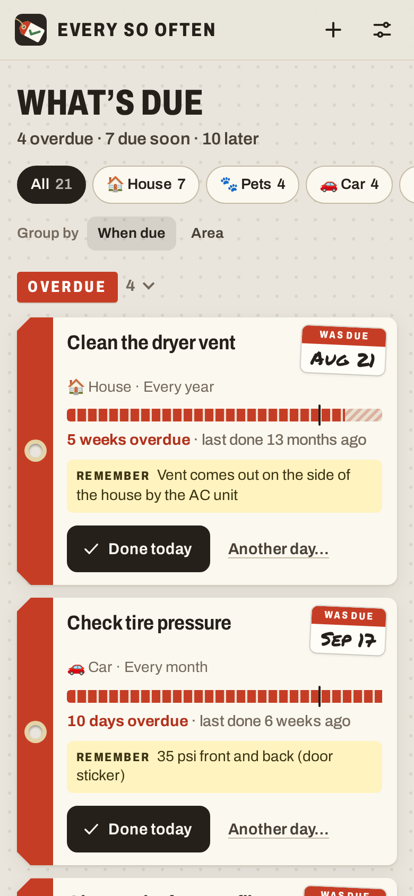
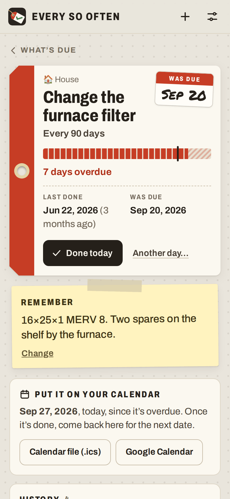
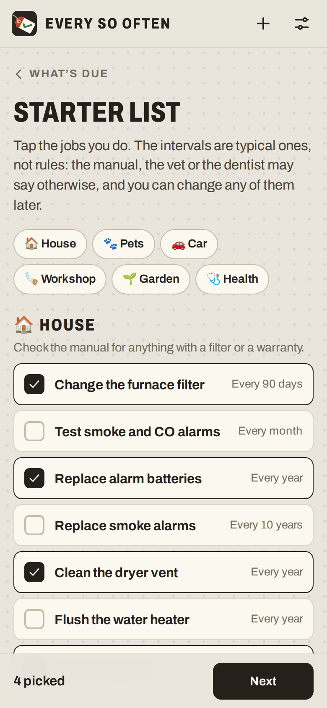
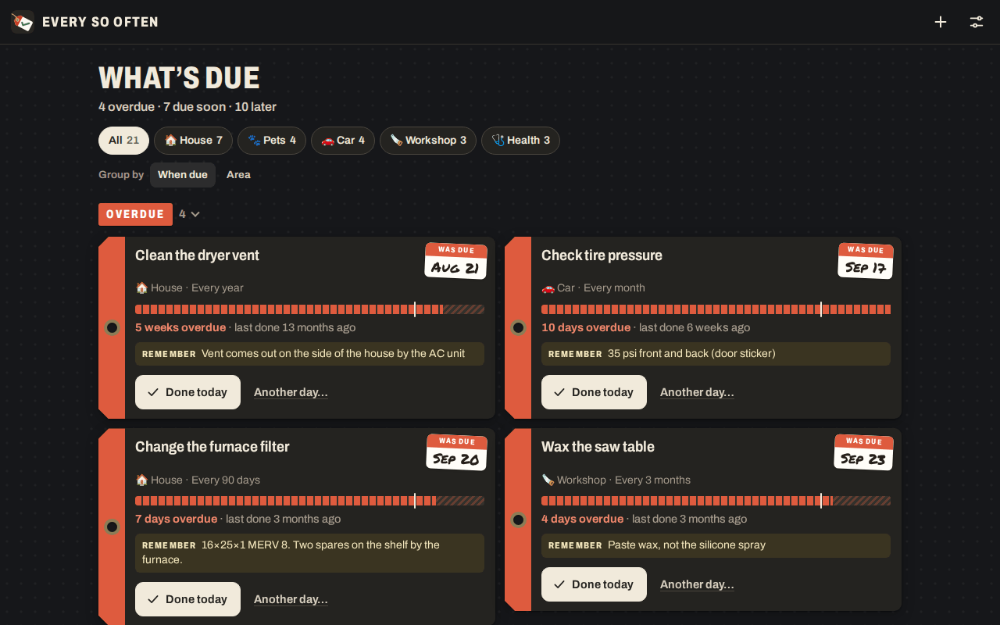

# Every So Often

**Use it: [junkdrawer.works/every-so-often](https://junkdrawer.works/every-so-often/)**

**Keep track of the jobs you do every few months and can never remember when you last did.** The furnace filter, the smoke alarm batteries, the dryer vent, the dog’s flea and heartworm pills, the chisels, the tires. Every So Often shows what’s overdue, what’s due soon and what’s fine, and one tap logs it done. If you want, it keeps the list on every device through your own Google Drive.

<p align="center">
  
  &nbsp;
  
  &nbsp;
  
</p>

<p align="center">
  
</p>

<sub>Screenshots use the sample household: a made-up house, dog and car with a year and a half of history.</sub>

## How it works

- **Each thing is a tag,** coloured like an inspection tag: red overdue, orange due now, amber due soon, green fine. The date it’s next due is written on a sticker in the corner, like the oil-change sticker on a windshield.
- **The gauge** fills from the last time you did it towards the due line. The hatched stretch before the line is “due soon”; past the line is overdue. Due soon starts about a seventh of the interval before the due date (at least a day, at most three weeks), and two weeks before a season opens.
- **One tap: Done today.** The tag gets a stamp and moves down the list, and Undo takes it back. **Another day…** logs yesterday, last week or any date, with an optional note like “16×25×1 MERV 8, $12”. Tap a tag for its history, where you can change or delete entries and see how often you’ve really been doing it.
- **How often:** every so many days, weeks, months or years, counted from the last time you did it (a monthly job done on January 31 comes due on the last day of February). Or **by season**, done once in each season you pick (“each spring and fall”), for either hemisphere. Or **in set months** (“every April and October”). A seasonal job done up to three weeks before its season counts for it, and one done after its season counts for the season before.
- **Group by when due or by area:** House, Pets, Car, Workshop, Garden, Health, or areas of your own. Tap an area to see only its things.
- **Remember** holds the fact you always forget: the filter size, which battery each alarm takes, the dose for the dog’s weight. It’s on the tag when the job comes due.
- **The starter list** has 67 common jobs for the house, pets, car, workshop, garden and health, with typical intervals. They’re typical, not rules: the manual, the vet or the dentist may say otherwise, and any of them can be changed. Say roughly when you last did each one and the list is useful straight away. Add your own things too, in your own areas.
- **Calendar:** put the next due date on Apple Calendar, Outlook or Google Calendar, as an .ics file or a Google Calendar link, or download one file with every next due date from Settings. They’re all-day events with a reminder at 9 in the morning.
- **Home-screen badge:** installed to a phone or computer, the app’s icon shows how many things are due while it’s open, where the system supports badges.
- **Sample data** to look around with, kept apart from your own list.
- No account and no server. Your list stays in your browser, and you can save a backup file and load it on another device. It works offline and installs to a phone’s home screen.

## Saving to Google Drive

Optional, and only at junkdrawer.works. **Settings → Save to Google Drive** signs in with Google and keeps the list in one file, `Every So Often.json`, in an `Every So Often` folder at the top of your Drive. Every device where you turn it on merges into that file. It asks Google for `drive.file`, so it can see only the files it made. The sign-in is the one every junkdrawer.works project shares: if you signed in to Shelfmark or Lotería in the last hour, it doesn’t ask again.

- **What syncs:** your things (name, area, how often, what to remember), every log entry and its note, deletions, and the hemisphere setting.
- **What stays on each device:** whether this device saves to Drive, the Google sign-in (good for an hour at a time), how the main screen is grouped and which groups are folded, and the sample data.
- **Merging** goes thing by thing and entry by entry, with change times, so “done” on your phone and “done” on your laptop both keep, and a deletion on one device reaches the others. The same job logged on two devices for the same day with the same note shows once. A device’s first sync takes the union of both lists, and the same starter job set up on two devices becomes one, with both histories.
- **The cloud button** in the bar is green when synced, amber while syncing, and red when Google wants you to sign in again, which it does after an hour; tap it to sign back in and sync. Your changes are saved on the device meanwhile.
- **Stop saving on this device** in Settings stops syncing there and leaves the list on the device and in Drive. It doesn’t sign the other junkdrawer.works projects out. To take the permission back altogether, remove junkdrawer.works under Third-party apps & services in your Google Account.
- It also reads your Google account’s name and email address, to show which account it saves to and to skip Google’s account chooser next time. That stays in your browser. More in [junkdrawer.works/privacy.html](https://junkdrawer.works/privacy.html).

## Running it

It’s a static site: plain HTML, CSS and JavaScript modules, with no build step.

```sh
npx serve .                   # or any static file server, then open the printed address
npm install                   # only for the tools below: esbuild and upng-js
npm test                      # the date maths and the merge (Node 20+), then the real page in Chromium (needs Playwright)
node tools/screenshots.mjs    # redraws docs/*.png and og.png
node tools/make-icons.mjs     # redraws the PNG icons from icon.svg
npm run build                 # dist/every-so-often.html and dist/artifact.html: the whole app in one file
```

Google Drive saving only shows at https://junkdrawer.works, the one address the junkdrawer.works Google sign-in accepts. The single-file copy leaves out Drive, backups and calendar files.

To put it online with GitHub Pages: **Settings → Pages → Build and deployment → Deploy from a branch**, then pick `main` and `/ (root)`.

### Files

- `js/due.js`: the date maths. It counts whole calendar days, never hours, so clock changes can’t move a due date. Month ends, leap days, seasons in either hemisphere, set months, what counts as due soon, and the words for all of it. No page code, so the tests run it in Node.
- `js/model.js`: the list, and how two copies of it merge. `js/store.js`: saving in the browser, the sample data and backups.
- `js/sync.js`: saving to Google Drive.
- `js/app.js`: the screens and which address shows which. `js/ui.js`: pieces every screen uses. `js/cal.js`: calendar files and links. `js/catalog.js`: the starter list. `js/sample.js`: the sample household.
- `fonts/`: Archivo (SIL Open Font License) and Permanent Marker (Apache License 2.0), served from here so nothing loads from elsewhere.
- `sw.js`: keeps a copy for using offline.
- `scripts/build.mjs`: the single-file copy.
- `test/unit.test.mjs` checks the date maths (month ends, leap days, seasons, time zones and clock changes) and the merge, including that it comes out the same in any order across hundreds of random lists. `test/e2e.mjs` sets up a list from the starter list, logs jobs, keeps notes, adds them to a calendar, backs up, looks at the sample and checks it works offline. Then three devices save through a stand-in Google Drive (`test/fake-google.mjs`): turning it on, a second device joining, both editing different things, both editing the same thing, a deletion, an expired sign-in, a sign-in from another project, and stopping.
